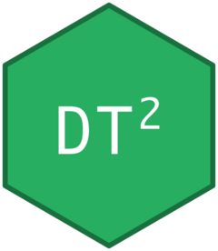

# DT2 

<!-- badges: start -->
[](https://github.com/StrategicProjects/DT2) 
 
 
 

<!-- badges: end -->

> **DataTables v2 for R** — modular, lightweight, works with or without Shiny.

DT2 is a modern `htmlwidgets` binding for
[DataTables.net v2](https://datatables.net/) with:

- **1:1 R ↔ JS mapping** — configure DataTables using plain R lists
- **Modular extensions** — load only Buttons, Select, Responsive, etc. when needed
- **Auto-detection** — DT2 scans your options and loads required extensions
- **Bootstrap 5** styling (or plain DataTables CSS)
- **Standalone** use in R Markdown, Quarto, and the Viewer (no Shiny required)
- **Full Shiny** integration: proxy, events, inline inputs, server-side processing

## Credits & Acknowledgments

DT2 is an **R wrapper** around the excellent
[**DataTables**](https://datatables.net/) JavaScript library created by
[**SpryMedia Ltd**](https://sprymedia.co.uk/) (Allan Jardine).
All table rendering, sorting, searching, pagination, and extensions are
powered entirely by the DataTables engine — DT2 simply provides the
bridge between R / htmlwidgets and the JavaScript API.

| Component | Author | License |
|---|---|---|
| [DataTables](https://datatables.net/) core + extensions | SpryMedia Ltd | MIT |
| [Bootstrap 5](https://getbootstrap.com/) integration | DataTables / Bootstrap | MIT |
| DT2 R package | André Leite, Hugo Medeiros, Diogo Bezerra | MIT |

This package takes inspiration from the original
[DT](https://rstudio.github.io/DT/) package by Yihui Xie (RStudio / Posit),
which wraps DataTables v1.x. DT2 was written from scratch to support the
DataTables v2 API, the modern `layout` system, and new extensions like
ColumnControl.

## Installation

```r
# From GitHub
remotes::install_github("StrategicProjects/DT2")
```

## Quick Start

### Standalone (no Shiny)

```r
library(DT2)

# Minimal
dt2(iris)

# With styling
dt2(mtcars,
    compact = TRUE, striped = TRUE, hover = TRUE, font_scale = 0.85,
    options = list(pageLength = 10))

# With export buttons
dt2(iris, options = list(
  pageLength = 10,
  buttons    = list("copy", "csv", "excel"),
  layout     = list(topEnd = "buttons")
))

# Save as standalone HTML
htmlwidgets::saveWidget(dt2(iris), "table.html")
```

### In Shiny (with bslib)

```r
library(shiny)
library(bslib)
library(DT2)

ui <- page_fillable(
  theme = bs_theme(version = 5, bootswatch = "flatly"),
  card(
    card_header("DT2 in Shiny"),
    card_body(dt2_output("tbl"))
  )
)

server <- function(input, output, session) {
  output$tbl <- render_dt2({
    dt2(iris,
        compact = TRUE, striped = TRUE, hover = TRUE,
        options = list(
          pageLength = 10,
          buttons    = list("copy", "csv", "excel"),
          layout     = list(topEnd = "buttons")
        ))
  })
}

shinyApp(ui, server)
```

## Extension System

DT2 ships with 15 DataTables extensions. See what's available:

```r
dt2_extensions()
#>            name version          dir
#> 1       Buttons   3.2.5      buttons
#> 2    ColReorder   2.1.1    colreorder
#> 3 ColumnControl   1.1.0 columncontrol
#> ...
```

Extensions are loaded **automatically** when DT2 detects them in your options,
or **explicitly** via the `extensions` argument:

```r
# Auto-detected (buttons in layout → loads Buttons extension)
dt2(iris, options = list(
  layout = list(topEnd = list(buttons = list("copy", "csv")))
))

# Explicit
dt2(iris, extensions = c("Buttons", "Select"))
```

## Translating DataTables.net Examples to R

Any example from [datatables.net](https://datatables.net/examples/) translates
directly to R lists:

| JavaScript | R |
|---|---|
| `{ pageLength: 25 }` | `list(pageLength = 25)` |
| `[1, 2, 3]` | `c(1, 2, 3)` |
| `{ layout: { topEnd: "buttons" } }` | `list(layout = list(topEnd = "buttons"))` |
| `function(d) { ... }` | `htmlwidgets::JS("function(d) { ... }")` |

See `vignette("js-config")` for a complete translation guide.


## Internationalization (i18n)

DataTables renders all interface text (pagination labels, search placeholder,
info line, button captions, etc.) from the `language` option.  Override any
term by passing a named list.

### Minimal — just the essentials

```r
dt2(iris, options = list(
  language = list(
    search       = "Buscar:",
    lengthMenu   = "Mostrar _MENU_ registros",
    info         = "Mostrando _START_ a _END_ de _TOTAL_",
    infoEmpty    = "Nenhum registro",
    zeroRecords  = "Nenhum resultado encontrado",
    paginate     = list(
      first = "«", previous = "‹", `next` = "›", last = "»"
    )
  )
))
```

### Complete pt-BR example

Below is a comprehensive Portuguese (Brazil) translation that covers the
core table, Buttons extension, and ColumnControl extension:

```r
lang_ptbr <- list(
  # ── Core table ──────────────────────────────────────────────
  lengthMenu     = "Mostrar _MENU_",
  search         = "Buscar",
  info           = "Mostrando _START_ a _END_ de _TOTAL_ registros",
  infoEmpty      = "Mostrando 0 a 0 de 0 registros",
  infoFiltered   = "(filtrado de _MAX_ registros no total)",
  zeroRecords    = "Nenhum registro encontrado",
  emptyTable     = "Nenhum dado disponível",
  loadingRecords = "Carregando dados...",
  decimal        = ",",
  thousands      = ".",
  infoThousands  = ".",
  paginate       = list(
    first = "«", previous = "‹", `next` = "›", last = "»"
  ),
  # Rótulos do menu "entries per page"
  # (mapeia o valor numérico → texto exibido no select)
  lengthLabels = list(
    `10` = "10", `25` = "25", `50` = "50", `-1` = "Todas"
  ),

  # ── Buttons extension ──────────────────────────────────────
  buttons = list(
    copyTitle   = "Copiado para a área de transferência",
    copyKeys    = paste0(
      "Pressione <i>Ctrl</i> ou <i>\u2318</i> + <i>C</i> para copiar. ",
      "Pressione Esc para cancelar."
    ),
    copySuccess = list(`_` = "%d linhas copiadas", `1` = "1 linha copiada")
  ),

  # ── ColumnControl extension ────────────────────────────────
  columnControl = list(
    colVis         = "Visibilidade da coluna",
    colVisDropdown = "Visibilidade da coluna",
    dropdown       = "Mostrar mais...",
    orderAsc       = "Ordem crescente",
    orderDesc      = "Ordem decrescente",
    orderClear     = "Remover ordenação",
    orderRemove    = "Remover ordenação",
    searchClear    = "Limpar pesquisa",
    searchDropdown = "Pesquisar",
    reorder        = "Reordenar",
    reorderLeft    = "Mover para a esquerda",
    reorderRight   = "Mover para a direita",
    list = list(
      all = "Todos", empty = "Vazio", none = "Nenhum",
      search = "Pesquisar..."
    ),
    search = list(
      text = list(
        contains = "Contém", empty = "Vazio", ends = "Termina em",
        equal = "Igual a", notContains = "Não contém",
        notEmpty = "Não está vazio", notEqual = "Diferente de",
        starts = "Começa por"
      ),
      number = list(
        empty = "Vazio", equal = "Igual a",
        greater = "Maior que", greaterOrEqual = "Maior ou igual a",
        less = "Menor que", lessOrEqual = "Menor ou igual a",
        notEmpty = "Não está vazio", notEqual = "Diferente de"
      ),
      datetime = list(
        empty = "Vazio", equal = "Igual a",
        greater = "Posterior a", less = "Anterior a",
        notEmpty = "Não está vazio", notEqual = "Diferente de"
      )
    )
  )
)

# Use it
dt2(iris, options = list(pageLength = 10, language = lang_ptbr))
```

### Using DataTables CDN translation files

DataTables provides ready-made translation files for 70+ languages.
You can load one directly via the `language.url` option:

```r
dt2(iris, options = list(
  language = list(
    url = "https://cdn.datatables.net/plug-ins/2.3.3/i18n/pt-BR.json"
  )
))
```

> **Note:** the CDN file covers the core table terms.  Extension-specific
> terms (Buttons, ColumnControl) must still be set manually via the
> `language` list as shown above.

Browse all available languages at:
<https://datatables.net/plug-ins/i18n/>


## Updating JS Libraries

All library versions are centralized in `tools/get-dt2-libs.sh`:

```bash
# Edit version variables at the top, then run:
bash tools/get-dt2-libs.sh
```

## Vignettes

| Vignette | Description |
|---|---|
| `vignette("getting-started")` | Standalone usage, themes, layout, pagination, buttons, scroller |
| `vignette("shiny-integration")` | Proxy, events, server-side processing (11 complete apps) |
| `vignette("extensions-guide")` | Buttons, Select, Responsive, ColumnControl, etc. |
| `vignette("formatting")` | Number/date formatting, custom JS renderers |
| `vignette("js-config")` | Translating DataTables.net JS examples to R |

A complete example app with ColumnControl, flags, custom renderers, and
full pt-BR translation is included at
[`inst/examples/app_complete.R`](inst/examples/app_complete.R).

## License

MIT — see [LICENSE](LICENSE) file.

DT2 bundles DataTables and extensions which are also MIT-licensed.
See [DataTables license](https://datatables.net/license/) for details.
